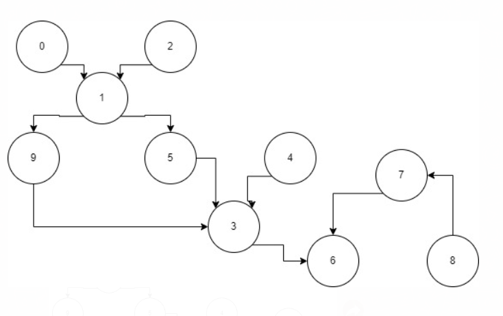

# IA-para-Jogos-Grafo-de-Dependencia
Atividade da disciplina de IA para Jogos

Programa feito na linguagem C#

# Grafo

# Legenda para o grafo:

0 - Restaurar resina

1 - Gastar resina

2 - Lutar contra Boss

3 - Ascender personagem

4 - Coletar itens do mapa

5 - Coletar gemas de elemento

6 - Subir nível de talento

7 - Coletar Material de talento

8 - Enfrentar domínio

9 - Coletar artefatos do Boss

# Instruções para rodar o programa:

Para rodar o programa é necessário instalar o dotnet e então, dentro da pasta Grafo-de-Depencias, digitar no terminal

dotnet run
